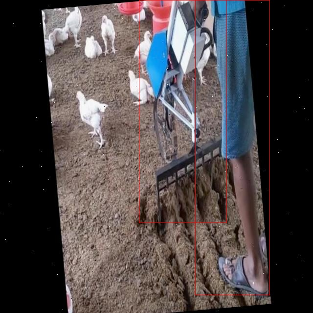

# 智能养殖场人机交互检测检测系统源码分享
 # [一条龙教学YOLOV8标注好的数据集一键训练_70+全套改进创新点发刊_Web前端展示]

### 1.研究背景与意义

项目参考[AAAI Association for the Advancement of Artificial Intelligence](https://gitee.com/qunmasj/projects)

项目来源[AACV Association for the Advancement of Computer Vision](https://kdocs.cn/l/cszuIiCKVNis)

研究背景与意义

随着全球人口的持续增长和城市化进程的加快，传统农业面临着巨大的挑战，尤其是在养殖业领域。为了满足日益增长的肉类需求，智能养殖场的建设逐渐成为行业发展的趋势。智能养殖场通过引入先进的技术手段，如物联网、人工智能和自动化设备，提高了养殖效率和动物福利。在这一背景下，基于改进YOLOv8的智能养殖场人机交互检测系统的研究显得尤为重要。

YOLO（You Only Look Once）系列模型因其高效的实时目标检测能力而受到广泛关注。YOLOv8作为该系列的最新版本，具备更强的检测精度和速度，适用于复杂的养殖环境。在智能养殖场中，人员与机器的协同工作是提高生产效率的关键，而人机交互检测系统则能够实时监测和分析养殖场内的人与机器的活动状态，确保生产过程的安全与高效。通过对人和机器的实时识别与跟踪，系统能够及时发现潜在的安全隐患，减少事故发生的概率。

本研究所使用的数据集包含6500张图像，涵盖了人和机器两个类别。这一数据集的构建为智能养殖场的人机交互检测提供了坚实的基础。通过对该数据集的深入分析和模型训练，能够有效提升YOLOv8在特定场景下的检测能力。人类在养殖场中的操作行为和机器的工作状态都能够被系统精准捕捉，从而实现对养殖环境的全面监控。这不仅提高了养殖场的管理效率，也为后续的智能决策提供了数据支持。

此外，智能养殖场的建设不仅是技术进步的体现，更是可持续发展的重要举措。通过引入智能化管理手段，养殖场能够更好地控制资源的使用，减少环境污染，实现生态与经济的双赢。基于改进YOLOv8的智能养殖场人机交互检测系统，将为养殖业的智能化转型提供有力的技术支撑，推动行业的可持续发展。

综上所述，基于改进YOLOv8的智能养殖场人机交互检测系统的研究具有重要的理论意义和实际应用价值。它不仅为智能养殖场的管理提供了新的思路和方法，也为相关领域的研究提供了丰富的数据支持和实践经验。通过不断优化和完善该系统，未来的智能养殖场将能够实现更高效、更安全的运营，为全球养殖业的可持续发展贡献力量。

### 2.图片演示


##### 注意：由于此博客编辑较早，上面“2.图片演示”和“3.视频演示”展示的系统图片或者视频可能为老版本，新版本在老版本的基础上升级如下：（实际效果以升级的新版本为准）

  （1）适配了YOLOV8的“目标检测”模型和“实例分割”模型，通过加载相应的权重（.pt）文件即可自适应加载模型。

  （2）支持“图片识别”、“视频识别”、“摄像头实时识别”三种识别模式。

  （3）支持“图片识别”、“视频识别”、“摄像头实时识别”三种识别结果保存导出，解决手动导出（容易卡顿出现爆内存）存在的问题，识别完自动保存结果并导出到tempDir中。

  （4）支持Web前端系统中的标题、背景图等自定义修改，后面提供修改教程。

  另外本项目提供训练的数据集和训练教程,暂不提供权重文件（best.pt）,需要您按照教程进行训练后实现图片演示和Web前端界面演示的效果。

### 3.视频演示

[3.1 视频演示](https://www.bilibili.com/video/BV169szeiEZ6/)

### 4.数据集信息展示

##### 4.1 本项目数据集详细数据（类别数＆类别名）

nc: 2
names: ['human', 'machine']


##### 4.2 本项目数据集信息介绍

数据集信息展示

在智能养殖场的人机交互检测系统的研究中，数据集的选择与构建至关重要。本项目所使用的数据集名为“smart poultry farm litter raking”，专门针对养殖场内人机交互的场景进行设计。该数据集的构建旨在提升YOLOv8模型在智能养殖环境中的检测精度和实时性，确保系统能够有效识别并区分人类操作员与自动化设备之间的互动。

该数据集包含两类主要对象，分别为“human”和“machine”。“human”类别涵盖了在养殖场中从事日常管理和操作的工作人员，他们可能在进行清理、喂养、监测等多种活动。而“machine”类别则主要指代用于辅助养殖工作的自动化设备，例如清理机、喂料机等。这两类对象的明确划分为后续的模型训练提供了清晰的目标，使得YOLOv8能够更好地学习和识别不同对象的特征。

在数据集的构建过程中，研究团队通过多种方式收集了大量的图像数据。这些图像不仅包括不同时间段和不同天气条件下的养殖场场景，还涵盖了多种操作情境，以确保数据集的多样性和代表性。例如，图像中可能出现的场景包括工作人员在清理鸡舍时与清理机的互动，或是工作人员在检查设备运行状态时的情形。这种多样化的场景设置能够有效提升模型的泛化能力，使其在实际应用中表现得更加稳健。

此外，为了提高数据集的标注质量，研究团队采用了专业的标注工具对图像进行了精确的标注。每一张图像中的“human”和“machine”对象都被框选并标记，确保模型在训练过程中能够获得准确的监督信号。这种精细的标注工作不仅提升了数据集的可靠性，也为后续的模型评估提供了坚实的基础。

在训练过程中，数据集的大小和多样性将直接影响模型的性能。为了确保YOLOv8能够在各种复杂环境中准确识别和区分人机交互，研究团队还考虑了数据增强技术，通过旋转、缩放、翻转等手段生成更多的训练样本。这一策略不仅丰富了数据集的内容，也有效降低了模型的过拟合风险。

综上所述，“smart poultry farm litter raking”数据集的构建与应用为智能养殖场人机交互检测系统的研究提供了坚实的基础。通过对“human”和“machine”这两类对象的精准识别，研究团队希望能够提升养殖场的自动化水平和管理效率，为未来的智能农业发展贡献力量。数据集的设计理念和实施过程不仅展示了科学研究中的严谨态度，也为相关领域的研究者提供了宝贵的参考和借鉴。





### 5.全套项目环境部署视频教程（零基础手把手教学）

[5.1 环境部署教程链接（零基础手把手教学）](https://www.ixigua.com/7404473917358506534?logTag=c807d0cbc21c0ef59de5)


[5.2 安装Python虚拟环境创建和依赖库安装视频教程链接（零基础手把手教学）](https://www.ixigua.com/7404474678003106304?logTag=1f1041108cd1f708b01a)

### 6.手把手YOLOV8训练视频教程（零基础小白有手就能学会）

[6.1 手把手YOLOV8训练视频教程（零基础小白有手就能学会）](https://www.ixigua.com/7404477157818401292?logTag=d31a2dfd1983c9668658)

### 7.70+种全套YOLOV8创新点代码加载调参视频教程（一键加载写好的改进模型的配置文件）

[7.1 70+种全套YOLOV8创新点代码加载调参视频教程（一键加载写好的改进模型的配置文件）](https://www.ixigua.com/7404478314661806627?logTag=29066f8288e3f4eea3a4)

### 8.70+种全套YOLOV8创新点原理讲解（非科班也可以轻松写刊发刊，V10版本正在科研待更新）

由于篇幅限制，每个创新点的具体原理讲解就不一一展开，具体见下列网址中的创新点对应子项目的技术原理博客网址【Blog】：


[8.1 70+种全套YOLOV8创新点原理讲解链接](https://gitee.com/qunmasj/good)

### 9.系统功能展示（检测对象为举例，实际内容以本项目数据集为准）

图9.1.系统支持检测结果表格显示

  图9.2.系统支持置信度和IOU阈值手动调节

  图9.3.系统支持自定义加载权重文件best.pt(需要你通过步骤5中训练获得)

  图9.4.系统支持摄像头实时识别

  图9.5.系统支持图片识别

  图9.6.系统支持视频识别

  图9.7.系统支持识别结果文件自动保存

  图9.8.系统支持Excel导出检测结果数据


### 10.原始YOLOV8算法原理

原始YOLOv8算法原理

YOLOv8是Ultralytics公司在2023年推出的最新目标检测算法，它在前几代YOLO模型的基础上进行了重大改进，结合了更先进的网络结构和训练策略，使得其在目标检测、图像分割和图像分类等任务中表现出色。YOLOv8的设计理念强调快速、准确和易于使用，因而成为了许多实际应用中的首选模型。

YOLOv8的网络结构主要由输入层、主干网络（Backbone）、特征增强网络（Neck）和检测头（Head）四个部分组成。输入层的设计考虑到了实际应用中图像长宽比的多样性，默认输入图像尺寸为640x640，但在推理阶段采用自适应缩放策略，确保长边按比例缩小到指定尺寸后，短边进行填充。这种处理方式有效减少了信息冗余，提高了目标检测的速度和精度。在训练阶段，YOLOv8引入了Mosaic图像增强技术，通过将四张随机选择的图像进行缩放和拼接，生成新的训练样本。这种方法不仅丰富了训练数据的多样性，还迫使模型学习不同位置和周围像素的特征，从而提升了预测精度。

在主干网络部分，YOLOv8借鉴了YOLOv7中的ELAN模块设计思想，将YOLOv5中的C3模块替换为C2F模块。C2F模块通过并行多个梯度流分支，增强了模型的梯度流信息，确保在保持轻量化的同时提高了检测精度。该模块的设计使得YOLOv8能够更有效地提取多尺度特征，增强了模型对复杂场景的适应能力。主干网络的末尾采用了SPP（Spatial Pyramid Pooling）模块，通过多个最大池化层处理多尺度特征，进一步提升了特征抽象能力。

特征增强网络（Neck）部分则利用了PAN（Path Aggregation Network）和FPN（Feature Pyramid Network）的结构，将不同尺度的特征图进行融合，以便为后续的检测头提供更丰富的信息。这种特征融合策略使得YOLOv8能够在处理不同大小目标时，依然保持较高的检测精度。

在检测头部分，YOLOv8的最大创新在于采用了解耦头（Decoupled Head）结构。与YOLOv5的耦合头（Coupled Head）不同，YOLOv8将目标检测和分类任务分为两个独立的分支。每个分支都通过1x1卷积进行降维，分别负责类别预测和边界框回归。这种解耦设计使得模型在处理复杂场景时，能够更专注于各自的任务，显著降低了定位不准和分类错误的概率。此外，YOLOv8还摒弃了传统的Anchor-based方法，转而采用Anchor-free策略。这一创新使得目标检测不再依赖于预设的锚框，而是通过回归方式直接预测目标的位置和大小，提升了模型的灵活性和泛化能力。

在损失函数的设计上，YOLOv8针对目标检测中的逻辑不一致性进行了优化。它在分类分支中继续使用二值交叉熵损失（BCELoss），而在边界框回归分支中则引入了分布焦点损失（DFL）和CIoU损失。这种设计旨在使网络模型更快地聚焦于标签附近的数值，从而提高检测精度。

YOLOv8在训练时间和检测精度上都得到了显著提升，模型的权重文件也经过进一步轻量化处理，使其能够部署在各种嵌入式设备上。这种高效的性能使得YOLOv8能够满足实时检测的需求，广泛应用于安防监控、自动驾驶、工业检测等领域。

总的来说，YOLOv8在网络结构、特征提取、损失函数设计等多个方面进行了创新和优化，充分体现了YOLO系列算法不断进化的理念。通过引入自适应缩放、Mosaic增强、C2F模块、解耦头和Anchor-free方法，YOLOv8不仅提升了目标检测的准确性和速度，也为未来的目标检测研究提供了新的思路和方向。随着YOLOv8的广泛应用，其在实际场景中的表现也将不断被验证和改进，推动目标检测技术的进一步发展。


### 11.项目核心源码讲解（再也不用担心看不懂代码逻辑）

#### 11.1 ui.py

以下是对给定代码的核心部分进行保留和详细注释的版本：

```python
import sys
import subprocess

def run_script(script_path):
    """
    使用当前 Python 环境运行指定的脚本。

    Args:
        script_path (str): 要运行的脚本路径

    Returns:
        None
    """
    # 获取当前 Python 解释器的路径
    python_path = sys.executable

    # 构建运行命令，使用 streamlit 运行指定的脚本
    command = f'"{python_path}" -m streamlit run "{script_path}"'

    # 执行命令并等待其完成
    result = subprocess.run(command, shell=True)
    
    # 检查命令执行的返回码，0 表示成功，非0表示出错
    if result.returncode != 0:
        print("脚本运行出错。")

# 主程序入口
if __name__ == "__main__":
    # 指定要运行的脚本路径
    script_path = "web.py"  # 这里可以直接指定脚本名，假设在当前目录下

    # 调用函数运行脚本
    run_script(script_path)
```

### 代码核心部分分析：

1. **导入模块**：
   - `sys`：用于获取当前 Python 解释器的路径。
   - `subprocess`：用于执行外部命令。

2. **`run_script` 函数**：
   - 功能：接收一个脚本路径，并使用当前 Python 环境运行该脚本。
   - 参数：`script_path`，指定要运行的脚本的路径。
   - 过程：
     - 使用 `sys.executable` 获取当前 Python 解释器的路径。
     - 构建一个命令字符串，使用 `streamlit` 模块运行指定的脚本。
     - 使用 `subprocess.run` 执行命令，并等待其完成。
     - 检查返回码以确定脚本是否成功运行，若返回码非0，则输出错误信息。

3. **主程序入口**：
   - 使用 `if __name__ == "__main__":` 确保只有在直接运行该脚本时才会执行以下代码。
   - 指定要运行的脚本路径（这里假设脚本在当前目录下）。
   - 调用 `run_script` 函数来执行指定的脚本。 

通过这些注释，可以更清晰地理解代码的功能和结构。


#### 11.1 70+种YOLOv8算法改进源码大全和调试加载训练教程（非必要）\ultralytics\utils\checks.py

以下是代码中最核心的部分，并附上详细的中文注释：

```python
import os
import re
import subprocess
from pathlib import Path
from typing import Optional

import torch
from ultralytics.utils import LOGGER, ROOT

def check_version(current: str = '0.0.0',
                  required: str = '0.0.0',
                  name: str = 'version',
                  hard: bool = False,
                  verbose: bool = False) -> bool:
    """
    检查当前版本是否满足所需版本或范围。

    参数:
        current (str): 当前版本或要获取版本的包名。
        required (str): 所需版本或范围（以pip风格格式）。
        name (str, optional): 在警告消息中使用的名称。
        hard (bool, optional): 如果为True，则在不满足要求时引发AssertionError。
        verbose (bool, optional): 如果为True，则在不满足要求时打印警告消息。

    返回:
        (bool): 如果满足要求则返回True，否则返回False。
    """
    if not current:  # 如果当前版本为空
        LOGGER.warning(f'WARNING ⚠️ invalid check_version({current}, {required}) requested, please check values.')
        return True
    elif not current[0].isdigit():  # 当前是包名而不是版本字符串
        try:
            name = current  # 将包名赋值给'name'参数
            current = metadata.version(current)  # 从包名获取版本字符串
        except metadata.PackageNotFoundError:
            if hard:
                raise ModuleNotFoundError(f'WARNING ⚠️ {current} package is required but not installed')
            else:
                return False

    if not required:  # 如果所需版本为空
        return True

    result = True
    c = parse_version(current)  # 将版本字符串解析为元组
    for r in required.strip(',').split(','):
        op, v = re.match(r'([^0-9]*)([\d.]+)', r).groups()  # 分离操作符和版本号
        v = parse_version(v)  # 将版本字符串解析为元组
        if op == '==' and c != v:
            result = False
        elif op == '!=' and c == v:
            result = False
        elif op in ('>=', '') and not (c >= v):  # 如果没有约束则假设为'>=required'
            result = False
        elif op == '<=' and not (c <= v):
            result = False
        elif op == '>' and not (c > v):
            result = False
        elif op == '<' and not (c < v):
            result = False
    if not result:
        warning_message = f'WARNING ⚠️ {name}{op}{required} is required, but {name}=={current} is currently installed'
        if hard:
            raise ModuleNotFoundError(warning_message)  # 断言版本要求满足
        if verbose:
            LOGGER.warning(warning_message)
    return result


def check_file(file, suffix='', download=True, hard=True):
    """搜索/下载文件（如有必要）并返回路径。"""
    check_suffix(file, suffix)  # 可选的后缀检查
    file = str(file).strip()  # 转换为字符串并去除空格
    if not file or ('://' not in file and Path(file).exists()):  # 文件存在
        return file
    elif download and file.lower().startswith(('https://', 'http://')):  # 下载
        url = file  # 警告：Pathlib将 :// 转换为 :/
        file = url2file(file)  # 将URL转换为文件路径
        if Path(file).exists():
            LOGGER.info(f'Found {url} locally at {file}')  # 文件已存在
        else:
            downloads.safe_download(url=url, file=file, unzip=False)  # 安全下载文件
        return file
    else:  # 搜索
        files = glob.glob(str(ROOT / '**' / file), recursive=True)  # 查找文件
        if not files and hard:
            raise FileNotFoundError(f"'{file}' does not exist")
        elif len(files) > 1 and hard:
            raise FileNotFoundError(f"Multiple files match '{file}', specify exact path: {files}")
        return files[0] if len(files) else []  # 返回文件


def check_python(minimum: str = '3.8.0') -> bool:
    """
    检查当前Python版本是否满足所需的最低版本。

    参数:
        minimum (str): 所需的最低Python版本。

    返回:
        None
    """
    return check_version(platform.python_version(), minimum, name='Python ', hard=True)
```

### 代码核心部分说明：
1. **check_version**：此函数用于检查当前版本是否满足所需版本的要求。它支持多种比较操作符（如`==`、`!=`、`>=`、`<=`等），并能够处理包名和版本字符串的情况。

2. **check_file**：此函数用于查找或下载指定的文件。它首先检查文件是否存在，如果不存在且是URL，则尝试下载该文件。如果文件存在，它将返回文件的路径。

3. **check_python**：此函数用于检查当前Python版本是否满足指定的最低版本要求。如果不满足，它将引发错误。

这些函数是确保环境配置正确和依赖项满足的基础，适用于YOLO等深度学习框架的使用。

这个程序文件是YOLOv8算法改进源码的一部分，主要用于检查和验证环境配置、依赖包、版本等。文件中包含了多个函数，每个函数的功能如下：

首先，`parse_requirements`函数用于解析`requirements.txt`文件，提取出所需的Python包及其版本要求。它会忽略以`#`开头的注释行，并返回一个包含包名和版本说明的字典列表。

接下来，`parse_version`函数将版本字符串转换为整数元组，方便进行版本比较。它会忽略任何附加的非数字字符串，并返回版本的主要、次要和修订号。

`is_ascii`函数检查给定字符串是否仅由ASCII字符组成。

`check_imgsz`函数用于验证图像尺寸是否为给定步幅的倍数，并在必要时进行调整。它确保图像尺寸符合训练和推理的要求。

`check_version`函数用于检查当前版本是否满足所需版本的要求。它支持多种比较操作符，并可以选择在不满足要求时抛出异常或仅打印警告信息。

`check_latest_pypi_version`函数返回指定PyPI包的最新版本，而`check_pip_update_available`函数检查当前安装的`ultralytics`包是否有更新可用。

`check_font`函数用于查找本地字体文件，如果未找到，则从指定URL下载。

`check_python`函数检查当前Python版本是否满足最低要求。

`check_requirements`函数检查已安装的依赖是否满足YOLOv8的要求，并在需要时尝试自动更新。

`check_torchvision`函数检查PyTorch和Torchvision的版本兼容性，确保它们之间的版本匹配。

`check_suffix`函数检查文件的后缀是否符合要求，而`check_yolov5u_filename`函数用于替换旧的YOLOv5文件名为更新的YOLOv5u文件名。

`check_file`和`check_yaml`函数用于搜索或下载文件，并返回其路径。

`check_imshow`函数检查环境是否支持图像显示，适用于调试和可视化。

`check_yolo`函数返回YOLO软件和硬件的摘要信息，包括CPU、RAM和磁盘使用情况。

`collect_system_info`函数收集并打印系统相关信息，包括操作系统、Python版本、RAM、CPU和CUDA信息。

`check_amp`函数检查PyTorch的自动混合精度（AMP）功能是否正常，以避免在训练中出现NaN损失或零mAP结果。

`git_describe`函数返回人类可读的git描述信息。

`print_args`函数用于打印函数参数，便于调试。

`cuda_device_count`和`cuda_is_available`函数用于检查可用的NVIDIA GPU数量和CUDA是否可用。

整体而言，这个文件提供了一系列工具函数，旨在确保YOLOv8算法在正确的环境中运行，帮助用户进行配置和调试。

#### 11.2 code\ultralytics\models\yolo\classify\train.py


这个程序文件是用于训练基于YOLO（You Only Look Once）模型的分类任务的，文件名为`train.py`，属于Ultralytics YOLO项目的一部分。程序首先导入了必要的库和模块，包括PyTorch、Torchvision以及Ultralytics的相关组件。

在程序中，定义了一个名为`ClassificationTrainer`的类，它继承自`BaseTrainer`类，专门用于分类模型的训练。类的构造函数`__init__`接收配置参数和可选的重写参数，设置任务类型为“classify”，并确保图像大小默认为224。

`set_model_attributes`方法用于从加载的数据集中设置YOLO模型的类名。`get_model`方法则返回一个经过修改的PyTorch模型，配置为适合YOLO训练。它会加载权重，并根据需要重置模型参数。

`setup_model`方法负责加载、创建或下载模型。它支持从本地文件、Torchvision模型或Ultralytics资源加载YOLO模型，并确保模型的输出形状与数据集的类别数相匹配。

`build_dataset`方法创建一个`ClassificationDataset`实例，接受图像路径和模式（如训练或测试）。`get_dataloader`方法返回一个PyTorch的DataLoader，负责对图像进行预处理，并支持分布式训练。

`preprocess_batch`方法用于处理一批图像和类别，将它们移动到指定的设备上。`progress_string`方法返回一个格式化的字符串，显示训练进度。

`get_validator`方法返回一个`ClassificationValidator`实例，用于验证模型。`label_loss_items`方法返回一个带有标签的训练损失项字典，尽管对于分类任务来说，这个方法并不是必需的。

`plot_metrics`方法从CSV文件中绘制指标，`final_eval`方法用于评估训练后的模型并保存验证结果。最后，`plot_training_samples`方法用于绘制带有注释的训练样本图像。

整体来看，这个程序文件为YOLO模型的分类任务提供了完整的训练框架，包括模型的设置、数据集的构建、训练过程的管理以及结果的可视化等功能。

#### 11.2 train.py

以下是经过简化和注释的核心代码部分，主要关注于YOLO模型的训练过程：

```python
import random
import numpy as np
import torch.nn as nn
from ultralytics.data import build_dataloader, build_yolo_dataset
from ultralytics.engine.trainer import BaseTrainer
from ultralytics.models import yolo
from ultralytics.nn.tasks import DetectionModel
from ultralytics.utils import LOGGER, RANK
from ultralytics.utils.torch_utils import de_parallel, torch_distributed_zero_first

class DetectionTrainer(BaseTrainer):
    """
    基于检测模型的训练类，继承自BaseTrainer类。
    """

    def build_dataset(self, img_path, mode="train", batch=None):
        """
        构建YOLO数据集。

        参数:
            img_path (str): 包含图像的文件夹路径。
            mode (str): 模式，可以是'train'或'val'，用于不同的数据增强。
            batch (int, optional): 批量大小，仅用于'rect'模式。默认为None。
        """
        gs = max(int(de_parallel(self.model).stride.max() if self.model else 0), 32)
        return build_yolo_dataset(self.args, img_path, batch, self.data, mode=mode, rect=mode == "val", stride=gs)

    def get_dataloader(self, dataset_path, batch_size=16, rank=0, mode="train"):
        """构造并返回数据加载器。"""
        assert mode in ["train", "val"]
        with torch_distributed_zero_first(rank):  # 仅在DDP中初始化数据集*.cache一次
            dataset = self.build_dataset(dataset_path, mode, batch_size)
        shuffle = mode == "train"  # 训练模式下打乱数据
        workers = self.args.workers if mode == "train" else self.args.workers * 2
        return build_dataloader(dataset, batch_size, workers, shuffle, rank)  # 返回数据加载器

    def preprocess_batch(self, batch):
        """对图像批次进行预处理，包括缩放和转换为浮点数。"""
        batch["img"] = batch["img"].to(self.device, non_blocking=True).float() / 255  # 归一化图像
        if self.args.multi_scale:  # 如果启用多尺度
            imgs = batch["img"]
            sz = (
                random.randrange(self.args.imgsz * 0.5, self.args.imgsz * 1.5 + self.stride)
                // self.stride
                * self.stride
            )  # 随机选择图像大小
            sf = sz / max(imgs.shape[2:])  # 计算缩放因子
            if sf != 1:
                ns = [
                    math.ceil(x * sf / self.stride) * self.stride for x in imgs.shape[2:]
                ]  # 计算新的图像形状
                imgs = nn.functional.interpolate(imgs, size=ns, mode="bilinear", align_corners=False)  # 调整图像大小
            batch["img"] = imgs
        return batch

    def get_model(self, cfg=None, weights=None, verbose=True):
        """返回YOLO检测模型。"""
        model = DetectionModel(cfg, nc=self.data["nc"], verbose=verbose and RANK == -1)
        if weights:
            model.load(weights)  # 加载权重
        return model

    def plot_training_samples(self, batch, ni):
        """绘制带有注释的训练样本。"""
        plot_images(
            images=batch["img"],
            batch_idx=batch["batch_idx"],
            cls=batch["cls"].squeeze(-1),
            bboxes=batch["bboxes"],
            paths=batch["im_file"],
            fname=self.save_dir / f"train_batch{ni}.jpg",
            on_plot=self.on_plot,
        )

    def plot_metrics(self):
        """从CSV文件中绘制指标。"""
        plot_results(file=self.csv, on_plot=self.on_plot)  # 保存结果图像
```

### 代码说明：
1. **构建数据集**：`build_dataset` 方法根据输入的图像路径和模式构建YOLO数据集，支持训练和验证模式。
2. **获取数据加载器**：`get_dataloader` 方法创建数据加载器，负责批量处理和数据打乱。
3. **预处理批次**：`preprocess_batch` 方法对输入的图像批次进行归一化和大小调整，以适应模型输入。
4. **获取模型**：`get_model` 方法返回一个YOLO检测模型，并可选择加载预训练权重。
5. **绘制训练样本**：`plot_training_samples` 方法用于可视化训练样本及其对应的标注。
6. **绘制指标**：`plot_metrics` 方法用于从CSV文件中绘制训练过程中的指标。

这些核心部分展示了YOLO模型训练的基本流程，包括数据准备、模型构建和结果可视化。

这个程序文件 `train.py` 是一个用于训练 YOLO（You Only Look Once）目标检测模型的实现，基于 Ultralytics 的 YOLO 框架。程序主要包含一个名为 `DetectionTrainer` 的类，该类继承自 `BaseTrainer`，用于处理与目标检测相关的训练过程。

在这个类中，首先定义了 `build_dataset` 方法，该方法用于构建 YOLO 数据集。它接收图像路径、模式（训练或验证）和批次大小作为参数。根据模型的最大步幅（stride），该方法会调用 `build_yolo_dataset` 函数来创建数据集。

接下来是 `get_dataloader` 方法，用于构建并返回数据加载器。它会根据模式（训练或验证）初始化数据集，并设置是否打乱数据的顺序。该方法还考虑了多进程的工作者数量，以提高数据加载的效率。

`preprocess_batch` 方法负责对图像批次进行预处理，包括将图像缩放到合适的大小并转换为浮点数格式。这个方法支持多尺度训练，能够随机选择图像的大小进行训练，以增强模型的鲁棒性。

`set_model_attributes` 方法用于设置模型的属性，包括类别数量和类别名称。这些信息会被附加到模型中，以便在训练过程中使用。

`get_model` 方法用于返回一个 YOLO 检测模型。它可以根据给定的配置和权重加载模型。

`get_validator` 方法返回一个用于验证 YOLO 模型的验证器，能够计算损失并进行模型评估。

`label_loss_items` 方法用于返回一个包含标记训练损失项的字典，这在目标检测和分割任务中是必要的。

`progress_string` 方法返回一个格式化的字符串，显示训练进度，包括当前的 epoch、GPU 内存使用情况、损失值、实例数量和图像大小等信息。

`plot_training_samples` 方法用于绘制训练样本及其标注，方便可视化训练过程中的数据。

最后，`plot_metrics` 和 `plot_training_labels` 方法分别用于绘制训练过程中的指标和创建带有标注的训练图像。这些可视化工具有助于监控模型的训练效果和性能。

整体而言，这个程序文件实现了 YOLO 模型训练的各个环节，从数据加载、预处理到模型训练和验证，提供了一个完整的训练框架。

#### 11.3 code\ultralytics\nn\__init__.py

```python
# 导入所需的任务模块
from .tasks import (
    BaseModel,            # 基础模型类
    ClassificationModel,  # 分类模型类
    DetectionModel,       # 检测模型类
    SegmentationModel,    # 分割模型类
    attempt_load_one_weight,  # 尝试加载单个权重
    attempt_load_weights,     # 尝试加载多个权重
    guess_model_scale,        # 猜测模型的缩放比例
    guess_model_task,         # 猜测模型的任务类型
    parse_model,              # 解析模型
    torch_safe_load,          # 安全加载PyTorch模型
    yaml_model_load,          # 从YAML文件加载模型
)

# 定义模块的公开接口
__all__ = (
    "attempt_load_one_weight",  # 公开的函数：尝试加载单个权重
    "attempt_load_weights",      # 公开的函数：尝试加载多个权重
    "parse_model",               # 公开的函数：解析模型
    "yaml_model_load",           # 公开的函数：从YAML文件加载模型
    "guess_model_task",          # 公开的函数：猜测模型的任务类型
    "guess_model_scale",         # 公开的函数：猜测模型的缩放比例
    "torch_safe_load",           # 公开的函数：安全加载PyTorch模型
    "DetectionModel",            # 公开的类：检测模型
    "SegmentationModel",         # 公开的类：分割模型
    "ClassificationModel",       # 公开的类：分类模型
    "BaseModel",                 # 公开的类：基础模型
)
```

### 注释说明：
1. **导入模块**：从当前包的 `tasks` 模块中导入多个模型类和函数，这些是构建和使用YOLO模型所需的核心组件。
2. **模型类**：
   - `BaseModel`：所有模型的基类，提供基本功能。
   - `ClassificationModel`：用于图像分类的模型。
   - `DetectionModel`：用于目标检测的模型。
   - `SegmentationModel`：用于图像分割的模型。
3. **函数**：
   - `attempt_load_one_weight`：尝试加载单个模型权重，通常用于初始化模型。
   - `attempt_load_weights`：尝试加载多个权重，适用于加载预训练模型。
   - `guess_model_scale`：根据输入信息猜测模型的缩放比例。
   - `guess_model_task`：根据模型的配置猜测其任务类型（如分类、检测或分割）。
   - `parse_model`：解析模型的结构和参数。
   - `torch_safe_load`：安全地加载PyTorch模型，避免潜在的错误。
   - `yaml_model_load`：从YAML配置文件中加载模型设置。
4. **`__all__`**：定义了模块的公开接口，指定了哪些类和函数可以被外部访问。

这个程序文件是Ultralytics YOLO（一个流行的目标检测模型）的初始化文件，遵循AGPL-3.0许可证。文件的主要功能是导入和组织与模型相关的任务和功能，以便在其他模块中使用。

首先，文件通过从同一目录下的`tasks`模块导入了一系列类和函数。这些导入的内容包括四种模型类：`BaseModel`、`ClassificationModel`、`DetectionModel`和`SegmentationModel`，这些类分别用于基础模型、分类模型、检测模型和分割模型的构建和使用。此外，还导入了一些与模型权重加载和解析相关的函数，如`attempt_load_one_weight`、`attempt_load_weights`、`guess_model_scale`、`guess_model_task`、`parse_model`、`torch_safe_load`和`yaml_model_load`。

接下来，文件定义了`__all__`变量，这是一个特殊的变量，用于控制当使用`from module import *`语句时，哪些名称会被导入。通过将相关的函数和类列入`__all__`中，确保了这些功能在模块外部可用，同时也隐藏了其他不需要暴露的内容。

总体来说，这个文件的作用是作为Ultralytics YOLO库的一个入口点，方便用户和开发者使用各种模型和工具，同时保持代码的组织性和可读性。

#### 11.4 code\ultralytics\models\yolo\segment\val.py

以下是代码中最核心的部分，并附上详细的中文注释：

```python
class SegmentationValidator(DetectionValidator):
    """
    SegmentationValidator类，继承自DetectionValidator类，用于基于分割模型的验证。
    """

    def __init__(self, dataloader=None, save_dir=None, pbar=None, args=None, _callbacks=None):
        """初始化SegmentationValidator，设置任务为'segment'，并初始化评估指标为SegmentMetrics。"""
        super().__init__(dataloader, save_dir, pbar, args, _callbacks)
        self.plot_masks = None  # 用于存储绘制的掩码
        self.process = None  # 掩码处理函数
        self.args.task = "segment"  # 设置任务类型为分割
        self.metrics = SegmentMetrics(save_dir=self.save_dir, on_plot=self.on_plot)  # 初始化评估指标

    def preprocess(self, batch):
        """预处理批次数据，将掩码转换为浮点数并发送到设备。"""
        batch = super().preprocess(batch)  # 调用父类的预处理方法
        batch["masks"] = batch["masks"].to(self.device).float()  # 将掩码转换为浮点数并移动到指定设备
        return batch

    def postprocess(self, preds):
        """后处理YOLO预测，返回输出检测结果和原型数据。"""
        p = ops.non_max_suppression(
            preds[0],  # 预测结果
            self.args.conf,  # 置信度阈值
            self.args.iou,  # IOU阈值
            labels=self.lb,  # 标签
            multi_label=True,  # 是否多标签
            agnostic=self.args.single_cls,  # 是否单类
            max_det=self.args.max_det,  # 最大检测数量
            nc=self.nc,  # 类别数量
        )
        proto = preds[1][-1] if len(preds[1]) == 3 else preds[1]  # 获取原型数据
        return p, proto  # 返回后处理结果和原型数据

    def update_metrics(self, preds, batch):
        """更新评估指标。"""
        for si, (pred, proto) in enumerate(zip(preds[0], preds[1])):  # 遍历每个预测
            self.seen += 1  # 增加已处理样本数量
            npr = len(pred)  # 当前预测数量
            stat = dict(
                conf=torch.zeros(0, device=self.device),  # 置信度
                pred_cls=torch.zeros(0, device=self.device),  # 预测类别
                tp=torch.zeros(npr, self.niou, dtype=torch.bool, device=self.device),  # 真阳性
                tp_m=torch.zeros(npr, self.niou, dtype=torch.bool, device=self.device),  # 真阳性（掩码）
            )
            pbatch = self._prepare_batch(si, batch)  # 准备批次数据
            cls, bbox = pbatch.pop("cls"), pbatch.pop("bbox")  # 获取类别和边界框
            nl = len(cls)  # 目标数量
            stat["target_cls"] = cls  # 记录目标类别
            if npr == 0:  # 如果没有预测
                if nl:
                    for k in self.stats.keys():
                        self.stats[k].append(stat[k])  # 更新统计信息
                continue

            # 处理掩码
            gt_masks = pbatch.pop("masks")  # 获取真实掩码
            predn, pred_masks = self._prepare_pred(pred, pbatch, proto)  # 准备预测结果和掩码
            stat["conf"] = predn[:, 4]  # 记录置信度
            stat["pred_cls"] = predn[:, 5]  # 记录预测类别

            # 评估
            if nl:
                stat["tp"] = self._process_batch(predn, bbox, cls)  # 处理边界框
                stat["tp_m"] = self._process_batch(
                    predn, bbox, cls, pred_masks, gt_masks, self.args.overlap_mask, masks=True
                )  # 处理掩码
                # 处理混淆矩阵
            for k in self.stats.keys():
                self.stats[k].append(stat[k])  # 更新统计信息

    def _process_batch(self, detections, gt_bboxes, gt_cls, pred_masks=None, gt_masks=None, overlap=False, masks=False):
        """
        返回正确的预测矩阵。

        参数:
            detections (array[N, 6]): 预测结果，包括边界框和类别
            gt_bboxes (array[M, 5]): 真实边界框
            gt_cls (array[M]): 真实类别

        返回:
            correct (array[N, 10]): 对应10个IOU水平的正确预测
        """
        if masks:
            # 处理掩码
            if overlap:
                nl = len(gt_cls)
                index = torch.arange(nl, device=gt_masks.device).view(nl, 1, 1) + 1
                gt_masks = gt_masks.repeat(nl, 1, 1)  # 扩展真实掩码
                gt_masks = torch.where(gt_masks == index, 1.0, 0.0)  # 处理重叠
            if gt_masks.shape[1:] != pred_masks.shape[1:]:
                gt_masks = F.interpolate(gt_masks[None], pred_masks.shape[1:], mode="bilinear", align_corners=False)[0]
                gt_masks = gt_masks.gt_(0.5)  # 二值化掩码
            iou = mask_iou(gt_masks.view(gt_masks.shape[0], -1), pred_masks.view(pred_masks.shape[0], -1))  # 计算掩码IOU
        else:  # 处理边界框
            iou = box_iou(gt_bboxes, detections[:, :4])  # 计算边界框IOU

        return self.match_predictions(detections[:, 5], gt_cls, iou)  # 匹配预测与真实标签

    def plot_predictions(self, batch, preds, ni):
        """绘制批次预测结果，包括掩码和边界框。"""
        plot_images(
            batch["img"],
            *output_to_target(preds[0], max_det=15),  # 绘制前15个检测结果
            torch.cat(self.plot_masks, dim=0) if len(self.plot_masks) else self.plot_masks,  # 绘制掩码
            paths=batch["im_file"],
            fname=self.save_dir / f"val_batch{ni}_pred.jpg",  # 保存文件名
            names=self.names,
            on_plot=self.on_plot,
        )  # 绘制结果
        self.plot_masks.clear()  # 清空绘制的掩码
```

### 代码核心部分说明：
1. **SegmentationValidator类**：用于分割模型的验证，继承自DetectionValidator，增加了处理掩码的功能。
2. **预处理和后处理**：在`preprocess`和`postprocess`方法中，分别对输入数据进行预处理和对模型输出进行后处理。
3. **更新指标**：`update_metrics`方法用于更新评估指标，处理每个批次的预测结果和真实标签。
4. **处理批次**：`_process_batch`方法用于计算预测结果与真实标签之间的IOU，返回正确的预测矩阵。
5. **绘制预测结果**：`plot_predictions`方法用于绘制模型的预测结果，包括掩码和边界框。

这些部分是实现分割模型验证的核心逻辑，确保模型的预测结果能够被正确评估和可视化。

这个程序文件是一个用于YOLO（You Only Look Once）模型的分割验证器，继承自检测验证器（DetectionValidator），专门用于处理图像分割任务。程序的主要功能是对分割模型的输出进行验证和评估，计算各种性能指标，并可视化结果。

首先，程序导入了一些必要的库，包括多线程处理、路径操作、NumPy、PyTorch等。然后定义了一个名为`SegmentationValidator`的类，构造函数中初始化了一些参数，包括数据加载器、保存目录、进度条、参数和回调函数。该类将任务类型设置为“segment”，并初始化分割指标。

在`preprocess`方法中，输入的批次数据经过处理，将掩码转换为浮点数并发送到指定设备。`init_metrics`方法用于初始化评估指标，并根据是否保存JSON格式的结果选择掩码处理函数。`get_desc`方法返回一个格式化的字符串，描述评估指标的名称。

`postprocess`方法对YOLO模型的预测结果进行后处理，返回输出检测和原型数据。`_prepare_batch`和`_prepare_pred`方法分别用于准备批次数据和预测数据，确保它们的格式适合后续处理。

在`update_metrics`方法中，程序对每个预测结果进行评估，计算真阳性、置信度和预测类别等指标，并更新统计信息。这里还处理了掩码的计算，包括与真实掩码的重叠情况。程序还支持可视化结果，保存预测掩码为JSON格式。

`finalize_metrics`方法用于设置评估指标的速度和混淆矩阵。`_process_batch`方法用于返回正确的预测矩阵，计算IoU（Intersection over Union）值，以评估检测框和掩码的准确性。

程序中还包含可视化方法，如`plot_val_samples`和`plot_predictions`，用于绘制验证样本和预测结果。`pred_to_json`方法将预测结果保存为JSON格式，便于后续评估。

最后，`eval_json`方法用于返回COCO风格的目标检测评估指标，使用pycocotools库计算mAP（mean Average Precision）等指标，确保模型的评估结果符合标准。

总体来说，这个程序文件实现了YOLO分割模型的验证流程，包括数据预处理、模型预测、结果评估和可视化等功能，适用于计算机视觉中的图像分割任务。

#### 11.5 code\ultralytics\models\yolo\detect\train.py

以下是代码中最核心的部分，并附上详细的中文注释：

```python
class DetectionTrainer(BaseTrainer):
    """
    扩展自 BaseTrainer 类的检测模型训练类。
    用于训练 YOLO 检测模型。
    """

    def build_dataset(self, img_path, mode="train", batch=None):
        """
        构建 YOLO 数据集。

        参数:
            img_path (str): 包含图像的文件夹路径。
            mode (str): 模式，`train` 表示训练模式，`val` 表示验证模式。
            batch (int, optional): 批次大小，仅用于 `rect` 模式。默认为 None。
        """
        gs = max(int(de_parallel(self.model).stride.max() if self.model else 0), 32)  # 获取模型的最大步幅
        return build_yolo_dataset(self.args, img_path, batch, self.data, mode=mode, rect=mode == "val", stride=gs)

    def get_dataloader(self, dataset_path, batch_size=16, rank=0, mode="train"):
        """构造并返回数据加载器。"""
        assert mode in ["train", "val"]  # 确保模式有效
        with torch_distributed_zero_first(rank):  # 仅在 DDP 中初始化数据集 *.cache 一次
            dataset = self.build_dataset(dataset_path, mode, batch_size)  # 构建数据集
        shuffle = mode == "train"  # 训练模式下打乱数据
        if getattr(dataset, "rect", False) and shuffle:
            LOGGER.warning("WARNING ⚠️ 'rect=True' 与 DataLoader 的 shuffle 不兼容，设置 shuffle=False")
            shuffle = False  # 如果是矩形模式且需要打乱，则不打乱
        workers = self.args.workers if mode == "train" else self.args.workers * 2  # 设置工作线程数
        return build_dataloader(dataset, batch_size, workers, shuffle, rank)  # 返回数据加载器

    def preprocess_batch(self, batch):
        """对一批图像进行预处理，包括缩放和转换为浮点数。"""
        batch["img"] = batch["img"].to(self.device, non_blocking=True).float() / 255  # 将图像转换为浮点数并归一化
        if self.args.multi_scale:  # 如果启用多尺度
            imgs = batch["img"]
            sz = (
                random.randrange(self.args.imgsz * 0.5, self.args.imgsz * 1.5 + self.stride)
                // self.stride
                * self.stride
            )  # 随机选择新的尺寸
            sf = sz / max(imgs.shape[2:])  # 计算缩放因子
            if sf != 1:
                ns = [
                    math.ceil(x * sf / self.stride) * self.stride for x in imgs.shape[2:]
                ]  # 计算新的形状
                imgs = nn.functional.interpolate(imgs, size=ns, mode="bilinear", align_corners=False)  # 进行插值缩放
            batch["img"] = imgs  # 更新图像
        return batch

    def get_model(self, cfg=None, weights=None, verbose=True):
        """返回 YOLO 检测模型。"""
        model = DetectionModel(cfg, nc=self.data["nc"], verbose=verbose and RANK == -1)  # 创建检测模型
        if weights:
            model.load(weights)  # 加载权重
        return model

    def get_validator(self):
        """返回用于 YOLO 模型验证的 DetectionValidator。"""
        self.loss_names = "box_loss", "cls_loss", "dfl_loss"  # 定义损失名称
        return yolo.detect.DetectionValidator(
            self.test_loader, save_dir=self.save_dir, args=copy(self.args), _callbacks=self.callbacks
        )

    def plot_training_samples(self, batch, ni):
        """绘制带有注释的训练样本。"""
        plot_images(
            images=batch["img"],
            batch_idx=batch["batch_idx"],
            cls=batch["cls"].squeeze(-1),
            bboxes=batch["bboxes"],
            paths=batch["im_file"],
            fname=self.save_dir / f"train_batch{ni}.jpg",
            on_plot=self.on_plot,
        )
```

### 代码核心部分说明：
1. **DetectionTrainer 类**：该类是用于训练 YOLO 检测模型的核心类，继承自 `BaseTrainer`。
2. **build_dataset 方法**：构建 YOLO 数据集，负责加载图像和标签，并根据模式选择不同的增强方法。
3. **get_dataloader 方法**：构造数据加载器，负责将数据集封装为可迭代的形式，并设置批次大小和工作线程数。
4. **preprocess_batch 方法**：对输入的图像批次进行预处理，包括归一化和多尺度调整。
5. **get_model 方法**：返回一个 YOLO 检测模型实例，可以选择加载预训练权重。
6. **get_validator 方法**：返回一个用于模型验证的验证器，记录损失信息。
7. **plot_training_samples 方法**：绘制训练样本及其对应的标签，用于可视化训练过程中的数据。

这个程序文件是一个用于训练YOLO（You Only Look Once）目标检测模型的Python脚本，属于Ultralytics库的一部分。它主要定义了一个名为`DetectionTrainer`的类，该类继承自`BaseTrainer`，并实现了一系列用于数据集构建、数据加载、模型训练和评估的功能。

在文件开头，导入了一些必要的库和模块，包括数学运算、随机数生成、深度学习框架PyTorch的神经网络模块、Ultralytics库中的数据处理和模型训练工具等。

`DetectionTrainer`类的构造函数中，定义了训练过程中所需的基本设置。它提供了一个示例，展示如何使用该类进行模型训练。用户可以通过传入模型配置、数据集路径和训练轮数等参数来初始化训练器，并调用`train()`方法开始训练。

类中的`build_dataset`方法用于构建YOLO数据集。它接收图像路径、模式（训练或验证）和批量大小作为参数，并调用`build_yolo_dataset`函数来创建数据集。该方法还会根据模型的步幅（stride）来确定数据集的处理方式。

`get_dataloader`方法用于构建数据加载器，确保在分布式训练时只初始化一次数据集。它根据训练或验证模式设置数据集的打乱方式，并返回构建好的数据加载器。

`preprocess_batch`方法负责对图像批次进行预处理，包括将图像缩放到合适的大小并转换为浮点数格式。该方法还支持多尺度训练，通过随机选择图像大小来增强模型的鲁棒性。

`set_model_attributes`方法用于设置模型的属性，包括类别数量和类别名称等，以确保模型能够正确处理输入数据。

`get_model`方法返回一个YOLO检测模型实例，支持加载预训练权重。

`get_validator`方法返回一个用于模型验证的检测验证器，负责计算训练过程中的损失。

`label_loss_items`方法用于生成一个包含训练损失项的字典，便于监控训练过程中的性能。

`progress_string`方法返回一个格式化的字符串，显示训练进度，包括当前轮次、GPU内存使用情况、损失值、实例数量和图像大小等信息。

`plot_training_samples`方法用于绘制训练样本及其标注，帮助可视化训练数据的质量。

最后，`plot_metrics`和`plot_training_labels`方法分别用于绘制训练过程中的性能指标和创建带标签的训练图，以便用户分析模型的训练效果。

整体而言，这个文件提供了一个完整的YOLO模型训练框架，涵盖了数据处理、模型构建、训练监控和结果可视化等多个方面，便于用户进行目标检测任务的模型训练和评估。

#### 11.6 code\ultralytics\nn\modules\block.py

以下是经过简化和注释的核心代码部分，主要包括了几个重要的模块：DFL、Proto、HGStem、HGBlock、SPP、C1、C2、C3等。这些模块在YOLO模型中起着关键作用。

```python
import torch
import torch.nn as nn
import torch.nn.functional as F

class DFL(nn.Module):
    """
    分布焦点损失（DFL）模块，主要用于目标检测中的损失计算。
    """
    def __init__(self, c1=16):
        """初始化卷积层，输入通道数为c1，输出通道数为1。"""
        super().__init__()
        self.conv = nn.Conv2d(c1, 1, 1, bias=False).requires_grad_(False)  # 不需要梯度更新
        x = torch.arange(c1, dtype=torch.float)  # 创建一个从0到c1-1的张量
        self.conv.weight.data[:] = nn.Parameter(x.view(1, c1, 1, 1))  # 设置卷积层的权重
        self.c1 = c1

    def forward(self, x):
        """前向传播，计算输出。"""
        b, c, a = x.shape  # b: batch size, c: channels, a: anchors
        return self.conv(x.view(b, 4, self.c1, a).transpose(2, 1).softmax(1)).view(b, 4, a)

class Proto(nn.Module):
    """YOLOv8的掩码原型模块，用于分割模型。"""
    def __init__(self, c1, c_=256, c2=32):
        """初始化掩码原型模块，指定输入通道数、原型数量和掩码数量。"""
        super().__init__()
        self.cv1 = Conv(c1, c_, k=3)  # 第一个卷积层
        self.upsample = nn.ConvTranspose2d(c_, c_, 2, 2, 0, bias=True)  # 上采样层
        self.cv2 = Conv(c_, c_, k=3)  # 第二个卷积层
        self.cv3 = Conv(c_, c2)  # 第三个卷积层

    def forward(self, x):
        """前向传播，进行上采样和卷积操作。"""
        return self.cv3(self.cv2(self.upsample(self.cv1(x))))

class HGStem(nn.Module):
    """
    PPHGNetV2的StemBlock，包含5个卷积层和一个最大池化层。
    """
    def __init__(self, c1, cm, c2):
        """初始化StemBlock，设置输入输出通道和卷积层参数。"""
        super().__init__()
        self.stem1 = Conv(c1, cm, 3, 2, act=nn.ReLU())  # 第一个卷积层
        self.stem2a = Conv(cm, cm // 2, 2, 1, 0, act=nn.ReLU())  # 第二个卷积层
        self.stem2b = Conv(cm // 2, cm, 2, 1, 0, act=nn.ReLU())  # 第三个卷积层
        self.stem3 = Conv(cm * 2, cm, 3, 2, act=nn.ReLU())  # 第四个卷积层
        self.stem4 = Conv(cm, c2, 1, 1, act=nn.ReLU())  # 第五个卷积层
        self.pool = nn.MaxPool2d(kernel_size=2, stride=1, padding=0, ceil_mode=True)  # 最大池化层

    def forward(self, x):
        """前向传播，执行StemBlock的计算。"""
        x = self.stem1(x)  # 经过第一个卷积层
        x = F.pad(x, [0, 1, 0, 1])  # 填充
        x2 = self.stem2a(x)  # 经过第二个卷积层
        x2 = F.pad(x2, [0, 1, 0, 1])  # 填充
        x2 = self.stem2b(x2)  # 经过第三个卷积层
        x1 = self.pool(x)  # 最大池化
        x = torch.cat([x1, x2], dim=1)  # 拼接
        x = self.stem3(x)  # 经过第四个卷积层
        x = self.stem4(x)  # 经过第五个卷积层
        return x

class C1(nn.Module):
    """CSP Bottleneck模块，包含1个卷积层。"""
    def __init__(self, c1, c2, n=1):
        """初始化CSP Bottleneck，设置输入输出通道和卷积层数量。"""
        super().__init__()
        self.cv1 = Conv(c1, c2, 1, 1)  # 第一个卷积层
        self.m = nn.Sequential(*(Conv(c2, c2, 3) for _ in range(n)))  # n个卷积层

    def forward(self, x):
        """前向传播，计算输出。"""
        y = self.cv1(x)  # 经过第一个卷积层
        return self.m(y) + y  # 残差连接

class C2(nn.Module):
    """CSP Bottleneck模块，包含2个卷积层。"""
    def __init__(self, c1, c2, n=1, shortcut=True, g=1, e=0.5):
        """初始化CSP Bottleneck，设置输入输出通道和卷积层数量等参数。"""
        super().__init__()
        self.c = int(c2 * e)  # 隐藏通道数
        self.cv1 = Conv(c1, 2 * self.c, 1, 1)  # 第一个卷积层
        self.cv2 = Conv(2 * self.c, c2, 1)  # 第二个卷积层
        self.m = nn.Sequential(*(Bottleneck(self.c, self.c, shortcut, g, e=1.0) for _ in range(n)))  # n个Bottleneck

    def forward(self, x):
        """前向传播，计算输出。"""
        a, b = self.cv1(x).chunk(2, 1)  # 将输入分成两部分
        return self.cv2(torch.cat((self.m(a), b), 1))  # 拼接并经过第二个卷积层

class C3(nn.Module):
    """CSP Bottleneck模块，包含3个卷积层。"""
    def __init__(self, c1, c2, n=1, shortcut=True, g=1, e=0.5):
        """初始化CSP Bottleneck，设置输入输出通道和卷积层数量等参数。"""
        super().__init__()
        c_ = int(c2 * e)  # 隐藏通道数
        self.cv1 = Conv(c1, c_, 1, 1)  # 第一个卷积层
        self.cv2 = Conv(c1, c_, 1, 1)  # 第二个卷积层
        self.cv3 = Conv(2 * c_, c2, 1)  # 第三个卷积层
        self.m = nn.Sequential(*(Bottleneck(c_, c_, shortcut, g, e=1.0) for _ in range(n)))  # n个Bottleneck

    def forward(self, x):
        """前向传播，计算输出。"""
        return self.cv3(torch.cat((self.m(self.cv1(x)), self.cv2(x)), 1))  # 拼接并经过第三个卷积层
```

以上代码展示了YOLO模型中一些核心模块的实现，包含了卷积层、瓶颈结构和特征融合等操作。每个模块都有其特定的功能，能够有效地处理输入数据并提取特征。

这个程序文件定义了一系列用于构建神经网络模块的类，主要是针对Ultralytics YOLO（You Only Look Once）模型的实现。文件中包含了多种卷积块、瓶颈结构和其他神经网络组件，适用于目标检测和图像分割等任务。

首先，文件导入了PyTorch库，并定义了一些基本的模块，包括卷积、深度卷积、Ghost卷积等。接着，使用`__all__`变量列出了可以被外部导入的模块名称，确保模块的封装性。

在具体的类定义中，`DFL`类实现了分布焦点损失的模块，用于目标检测中的损失计算。它通过一个卷积层将输入张量转换为特定的输出格式。

`Proto`类是YOLOv8的掩码原型模块，主要用于分割模型。它通过一系列卷积和上采样操作来处理输入数据。

`HGStem`类实现了PPHGNetV2的StemBlock，包含多个卷积层和一个最大池化层，用于特征提取。

`HGBlock`类则是PPHGNetV2中的一个基本模块，使用了轻量级卷积（LightConv）或标准卷积（Conv），通过多个卷积层构建特征提取的深度网络。

`SPP`和`SPPF`类实现了空间金字塔池化（Spatial Pyramid Pooling）层，能够在不同尺度上进行特征提取，从而增强模型对不同大小目标的检测能力。

`C1`、`C2`、`C3`等类实现了不同层次的CSP（Cross Stage Partial）瓶颈结构，分别使用不同数量的卷积层来提取特征，并通过跳跃连接（shortcut）增强网络的表达能力。

`GhostBottleneck`类实现了Ghost网络中的瓶颈结构，利用Ghost卷积来减少计算量，同时保持较好的特征提取能力。

`Bottleneck`和`BottleneckCSP`类则实现了标准的瓶颈结构和CSP瓶颈结构，分别用于构建更深的网络。

最后，`ResNetBlock`和`ResNetLayer`类实现了ResNet结构中的基本块和层，提供了标准卷积层的实现，适用于更复杂的网络架构。

整体来看，这个文件提供了构建YOLO及其变种模型所需的基础模块，能够支持多种深度学习任务，尤其是在计算机视觉领域。每个模块都经过精心设计，以便在保持高效性的同时，增强模型的表现力和鲁棒性。

### 12.系统整体结构（节选）

### 程序整体功能和构架概括

该程序是一个基于YOLOv8的目标检测和图像分类框架，提供了完整的训练、验证和评估流程。它包括多个模块，负责不同的功能，如数据加载、模型构建、训练过程管理、结果可视化等。通过一系列工具函数和类，用户可以方便地配置和调试YOLO模型，以适应不同的计算机视觉任务。

程序的结构清晰，模块化设计使得各个功能之间的耦合度低，便于维护和扩展。整体而言，该框架为用户提供了一个高效、灵活的环境来进行目标检测和图像分类任务。

### 文件功能整理表

| 文件路径                                                                                       | 功能描述                                                                                               |
|-----------------------------------------------------------------------------------------------|--------------------------------------------------------------------------------------------------------|
| `ui.py`                                                                                       | 提供用户界面相关功能，支持模型训练和评估的可视化。                                                    |
| `ultralytics/utils/checks.py`                                                                 | 检查依赖项是否满足YOLOv8要求，确保环境配置正确，提供多种检查工具函数。                                |
| `code/ultralytics/models/yolo/classify/train.py`                                             | 实现YOLO模型的分类任务训练框架，包括数据集构建、训练过程管理和结果可视化。                          |
| `train.py`                                                                                    | 提供YOLO模型训练的主流程，包括数据加载、模型设置和训练监控等功能。                                  |
| `code/ultralytics/nn/__init__.py`                                                            | 作为Ultralytics YOLO库的入口点，组织和导出模型和工具函数。                                           |
| `code/ultralytics/models/yolo/segment/val.py`                                               | 实现YOLO分割模型的验证流程，包括数据预处理、模型预测和结果评估。                                    |
| `code/ultralytics/models/yolo/detect/train.py`                                              | 实现YOLO目标检测模型的训练流程，涵盖数据处理、模型构建和训练监控等功能。                            |
| `code/ultralytics/nn/modules/block.py`                                                       | 定义YOLO模型的基本模块和构建块，支持模型的构建和参数设置。                                          |
| `code/train.py`                                                                                | 提供训练过程的管理和监控，整合不同模块以实现完整的训练流程。                                         |
| `ultralytics/nn/backbone/repvit.py`                                                          | 实现YOLO模型的骨干网络，提供特征提取功能。                                                            |
| `code/ultralytics/trackers/utils/kalman_filter.py`                                           | 实现卡尔曼滤波器，用于目标跟踪和状态估计。                                                           |
| `ultralytics/nn/extra_modules/block.py`                                                      | 定义额外的模块和功能，扩展YOLO模型的能力。                                                            |
| `code/ultralytics/hub/auth.py`                                                                | 处理模型库的身份验证和授权功能，确保用户能够安全地访问模型资源。                                     |

这个表格总结了各个文件的主要功能，帮助用户快速了解程序的结构和功能模块。

注意：由于此博客编辑较早，上面“11.项目核心源码讲解（再也不用担心看不懂代码逻辑）”中部分代码可能会优化升级，仅供参考学习，完整“训练源码”、“Web前端界面”和“70+种创新点源码”以“13.完整训练+Web前端界面+70+种创新点源码、数据集获取”的内容为准。

### 13.完整训练+Web前端界面+70+种创新点源码、数据集获取


# [下载链接：https://mbd.pub/o/bread/ZpuZlZ9p](https://mbd.pub/o/bread/ZpuZlZ9p)